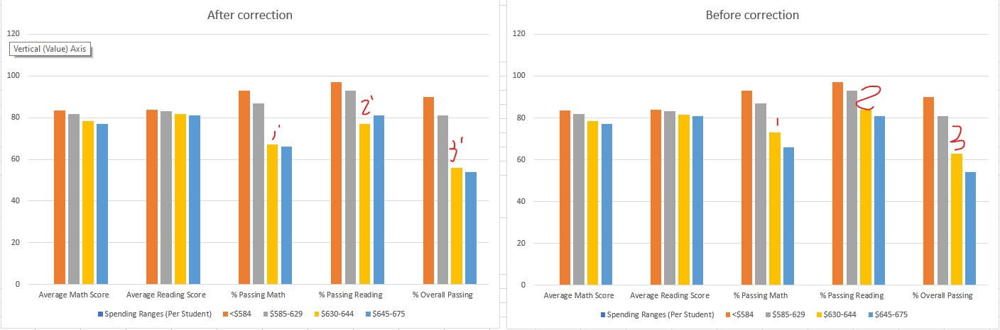

# School_District_Analysis

In this repository I demonstrated skills using python and jupyter notebook to perform data analysis of mock scenario to analysis school district data.  

✓ How is the district summary affected?

The district summary is affected by a small amount where avg math scores went from 78.98 to 78.93, and avg reading scores went from 81.87 to 81.85, and the 3 metrics of Percentages of passing all dropped about 1%

✓ How is the school summary affected?

Only the Thomas High school number are affected as expected, while average scores of math and reading were affected less than 1%, % of passing math and reading, as well as overall passing decreased significantly.  The 3 later metrics dropped from 90th percentile to 60th percentile.

✓ How does removing the ninth graders’ math and reading scores affect Thomas High School’s performance, relative to the other schools?

The most notable changes are that % passing read, math, and overall decreased.  If we evaluate the school by % Overall Passing, then Thomas High School went from 2nd place to 8th place out of 15 schools.  

✓ How does removing the ninth grade scores affect the following
- Math and Reading Scores by Grade
- Scores by School Spending
- Scores by School Size
- Scores by School Type

By removing the Thomas High School 9th grade score, we changed only Thomas High School's read and math grades from around 83 percent to NaN.  
Thomas High School's spending is not affected, nor is school size and type.  However, as the data changed, it painted a very different picture. 
While the Math and Reading scores by grade on overall data is affected very little, it lowered the school spending type between $630-644 per student on passing, which is the spending range that Thomas school is in.  
It also lower the same metrics, % passing and overall passing, more notably in the medium school size (1000-2000).  
Finally, it also affected the same metrics more notably for Charter schools.  The actual values can be extracted by the jupyter notebook in python result/output.

One of the graphs we can produce
 
